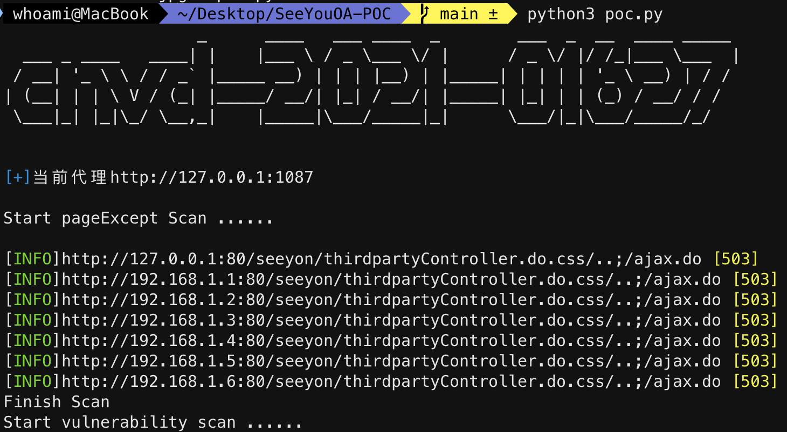

# 声明
本程序仅供安全学习使用,使用遵守《中华人民共和国网络安全法》,不能用于非授权测试,脚本开发者不负任何连带法律责任

# 简介
致远OA ajax.do 任意文件上传 CNVD-2021-01627 的 POC 

    在urls.txt的文件中添加目标地址来对该漏洞进行批量验证,运行脚本后会将可能存在漏洞的url写入result.txt的文件,程序会读取result.txt文件最终POC验证成功后会把存在漏洞的url写入vulnerability_URL.txt文件
> python3 poc.py

